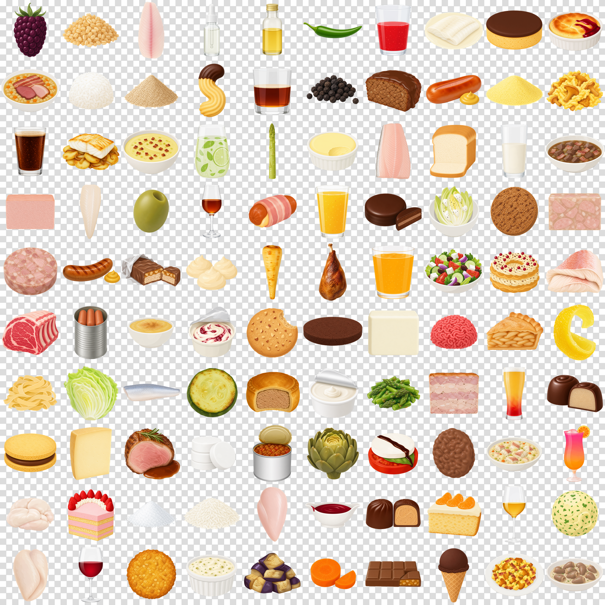

# BLS 4.0 (Bundeslebensmittelschlüssel) Icon Set

In my project [ACP](https://git.moritz.run/moritz/act) (Adaptive Calorie Tracker) I am using the BLS Dataset for the nutritional information of generic German products. Unfortunatley I was missing clean, same-styled Icons for each of the 7140 individual entries. Thats why I used AI to genrate my own. If you need something like this too: here you go.

10 random samples per BLS Hauptgruppe, one row per category:


Same items with backgrounds removed (the checker is just to show the alpha
— the actual files are transparent):



> **Mirror notice.** This repo lives canonically at
> [git.moritz.run/moritz/bls-icons](https://git.moritz.run/moritz/bls-icons)
> with all icons stored via Git LFS. The
> [GitHub mirror](https://github.com/EiSiMo/bls-icons) carries the code and
> metadata only — clone from the canonical source if you want the binary
> images.

## Use it in your app

```bash
git clone ssh://git@git.moritz.run:2222/moritz/bls-icons.git
cd bls-icons
git lfs pull        # download all 4987 PNGs (~4.5 GB)
```

```python
import csv
aliases = dict(row.values() for row in csv.DictReader(open("aliases.csv")))
icon_path = f"icons_raw/{aliases[bls_code]}.png"
```

Without `git lfs pull` you only get the metadata (~23 MB, clones in seconds).

## Dataset

| | |
|---|---|
| BLS 4.0 entries covered | 7140 |
| Distinct icons | 4987 |
| Resolution | 1024×1024 PNG |
| `icons_raw/` | source images, white background |
| `icons/` | transparent (after background removal) |
| `items.csv` | one row per icon: `code, name_de, name_en` |
| `aliases.csv` | full mapping `bls_code → icon_code` (7140 rows) |

The 7140 → 4987 reduction collapses items that differ only by preparation
method (raw, cooked, fried, ...) onto a shared icon. Lookup at app runtime:

```python
icon_path = f"icons/{aliases[bls_code]}.png"
```

## How it was made

The dataset was built in two phases: a one-shot generation pass for the
initial 4987 icons, then a manual review loop that refined ~22 % of them
based on per-item visual feedback.

### Phase 1: initial generation

1. **Source.** BLS 4.0 Excel parsed via `openpyxl`, 7140 items.
2. **Deduplication.** Regex-strip preparation suffixes from item names →
   4987 canonical icons. `aliases.csv` keeps the full mapping so any BLS
   code can resolve to its icon.
3. **Prompt generation.** Per item, `gpt-5-mini` reads the German + English
   name and the style spec (`comic_v4.md` in
   [act-img-gen](https://git.moritz.run/moritz/act-img-gen)) and returns
   an image prompt. Sync API call, ~3 cents per 100 items.
4. **Image generation.** `gpt-image-2` at quality `low`, 1024×1024, via
   the OpenAI Batch API (50 % discount, async with 24 h window). Output
   is a PNG with white background. ~$22 for the full 4987-item run.
5. **Background removal.** `BiRefNet-massive` via the `rembg` library,
   run on Modal serverless A10G GPUs. ~$0.25 and ~10–12 min wall time
   for 4987 icons.
6. **Output.** White-bg PNGs in `icons_raw/`, transparent PNGs in `icons/`.

The orchestrator `run_pipeline.py` chains all steps with retries,
idempotent resume, full logging to `pipeline.log`, and synchronous
regeneration for items that hit OpenAI's image moderation (raw animal
products occasionally trigger false-positive `safety_violations=[sexual]`).

### Phase 2: manual review + iterative regeneration

Every icon was hand-reviewed using `tools/review.py`, a Tkinter app that
shows three side-by-side panels per item — PIL flood-fill alpha, BiRefNet
alpha, and the raw white-bg image — plus the prompt that produced them.
For each item the reviewer chose which alpha-removal method came out
better, optionally flagged image hallucinations with a one-line note
("Buttermilch ist eingebacken, nicht zu sehen"), or marked the item as
"both bad" for full regen.

The flagged items then went through a small pipeline:

1. **`tools/swap_pil_alphas.py`** — for items where the reviewer picked
   "PIL flood-fill better", swap `icons/<code>.png` to a fresh
   full-resolution flood-fill mask. Cheap; no image regen needed.
2. **`tools/prepare_round2.py`** — for items with specific feedback, ask
   `gpt-5-mini` to rewrite the original prompt incorporating the German
   reviewer note. The trailing style block stays verbatim.
3. **`tools/run_round2_batch.py`** — submit a fresh OpenAI image batch
   for all flagged items, snapshotting the prior images first so the
   review tool can show "before" thumbnails next round.
4. **`tools/run_round2_finalize.py`** — sync the new images back into
   `icons_raw/`, delete the stale alphas, re-run Modal bg-removal.
5. **`tools/migrate_review_for_round2.py`** — move the resolved review
   entries into `review_history` and reset the navigation set so the
   reviewer only sees newly-regenerated items in the next pass.

After two iteration rounds plus a small batch of manual swaps and
canonical-image dedups, the dataset stabilised. Final tally of
post-generation refinements:

| Action | Items | Note |
|---|---|---|
| PIL-flood-fill alpha swap | 489 | BiRefNet's mask was worse than naïve flood-fill |
| Prompt rewrite + image regen (round 2) | 574 | gpt-5-mini rewrote prompt from reviewer feedback |
| Prompt rewrite + image regen (round 3) | 38 | further iteration on still-wrong items |
| Dedup to canonical image | 16 | white-powder items (flour, starch, milk powder) → `C213200` |
| Revert to round-1 image | 5 | regen came out worse than the original |
| Manual image swap | 6 | toast variants, milk containers, grape juice |
| **Total refined** | **1128** | ~22 % of the 4987 icons |

Total post-generation cost: ~$2.66 (OpenAI prompter $0.18, image batch
$2.40, Modal A10G $0.08).

## Regenerate or extend

```bash
# companion repo: prompter + image-gen + style spec
git clone ssh://git@git.moritz.run:2222/moritz/act-img-gen.git ../act-img-gen

# local deps
pip install -r requirements.txt
pip install -r ../act-img-gen/requirements.txt

# OpenAI key for prompter + image gen
echo "OPENAI_API_KEY=sk-..." > ../act-img-gen/.env

# end-to-end run (~$22 + ~$0.25 Modal, completes in <24 h)
python run_pipeline.py
```

To run the review loop on your own copy, install `Pillow`, then:

```bash
python tools/review.py     # Tkinter window; state persists in review.json
```

## Models

| Step | Model | Mode | Approx. cost (full 4987-item run) |
|---|---|---|---|
| Prompter | `gpt-5-mini` (`reasoning_effort=minimal`) | sync | ~$1 |
| Image gen | `gpt-image-2` quality `low` | OpenAI Batch | ~$22 |
| Background removal | `BiRefNet-massive` (rembg) | Modal A10G GPU | ~$0.25 |
| Feedback-driven prompt rewrite | `gpt-5-mini` | sync | ~$0.0004 / item |

## Repo layout

```
.
├── items.csv               4987 canonical icons (code, name_de, name_en)
├── aliases.csv             7140 BLS-code → icon-code mapping
├── run_pipeline.py         end-to-end orchestrator (entry point)
├── modal_postprocess.py    Modal entry point for background removal
├── grid.png                README preview (regenerable via tools/make_grid.py)
├── grid_alpha.png          transparent variant of the same grid
├── icons_raw/              white-bg PNGs (LFS)
├── icons/                  transparent PNGs after bg removal (LFS)
└── tools/
    ├── sync_icons.py                    copies act-img-gen output → icons_raw/
    ├── build_viewer.py                  builds index.html (gitignored, run locally)
    ├── make_grid.py                     regenerates grid.png / grid_alpha.png
    ├── fix_missing.py                   sync regen for items missing from icons_raw/
    ├── review.py                        interactive review GUI (Tkinter)
    ├── swap_pil_alphas.py               recompute PIL-flood-fill alphas at full res
    ├── prepare_round2.py                feedback-aware prompt rewriter
    ├── run_round2_batch.py              submit OpenAI image batch for flagged items
    ├── run_round2_finalize.py           sync + drop stale alphas + Modal bg-removal
    ├── migrate_review_for_round2.py     prepare review.json for the next round
    └── stash_round1.py                  extract prior-round images from git LFS
```

The `round2` in the script names is a historical artefact — the same
scripts handle round 3, round 4, …; each invocation just operates on
whatever's currently flagged in `review.json`.

## Storage

Icons are stored via **Git LFS** (`*.png` in `icons/` and `icons_raw/`).
A plain `git clone` only fetches the small text/CSV files; binaries
arrive on first checkout (or `git lfs pull`). The repo itself stays
small enough to clone in seconds.

The pre-review v1 dataset is preserved at tag `v1.0`:

```bash
git checkout v1.0       # or: git lfs pull --include='icons/*' --revision v1.0
```

## License

Released into the public domain under [CC0 1.0](LICENSE). Use, modify, and
redistribute the icons, code, and metadata for any purpose without attribution.
