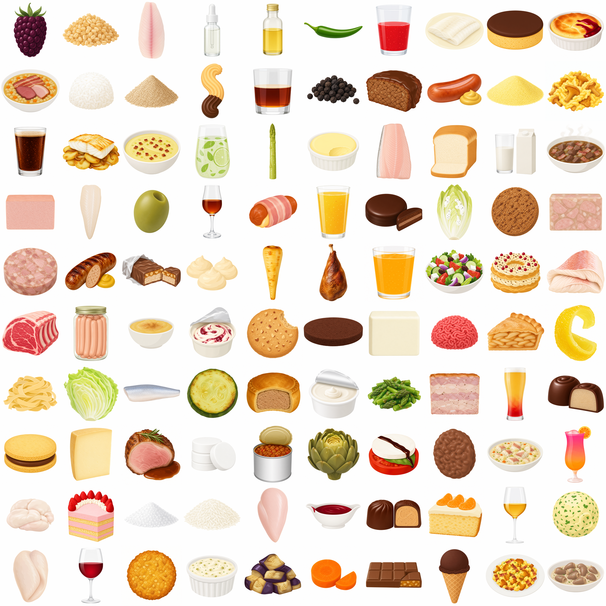

# BLS 4.0 (Bundeslebensmittelschlüssel) Icon Set

In my project [ACP](https://git.moritz.run/moritz/act) (Adaptive Calorie Tracker) I am using the BLS Dataset for trhe nutritional information of generic German products. Unfortunatley I was missing clean, same-styled Icons for each of the 7140 individual entries. Thats why I used AI to genrate my own. If you need something like this too: here you go.



## Use it in your app

```bash
git clone ssh://git@git.moritz.run:2222/moritz/bls-icons.git
cd bls-icons
git lfs pull        # download all 4987 PNGs (~4.5 GB)
```

```python
import csv
aliases = dict(row.values() for row in csv.DictReader(open("aliases.csv")))
icon_path = f"icons_raw/{aliases[bls_code]}.png"
```

Without `git lfs pull` you only get the metadata (~23 MB, clones in seconds).

## Regenerate or extend

```bash
# companion repo: prompter + image-gen + style spec
git clone ssh://git@git.moritz.run:2222/moritz/act-img-gen.git ../act-img-gen

# local deps
pip install -r requirements.txt
pip install -r ../act-img-gen/requirements.txt

# OpenAI key for prompter + image gen
echo "OPENAI_API_KEY=sk-..." > ../act-img-gen/.env

# end-to-end run (~$22, batch completes in <24 h)
python run_pipeline.py --skip-modal

# optional second stage: transparent backgrounds via Modal T4 GPUs (~$0.70)
modal token new
python -m modal run modal_postprocess.py
```

## Dataset

| | |
|---|---|
| BLS 4.0 entries covered | 7140 |
| Distinct icons | 4987 |
| Resolution | 1024×1024 PNG |
| `icons_raw/` | source images, white background |
| `icons/` | transparent (after background removal) |
| `items.csv` | one row per icon: `code, name_de, name_en` |
| `aliases.csv` | full mapping `bls_code → icon_code` (7140 rows) |

The 7140 → 4987 reduction collapses items that differ only by preparation
method (raw, cooked, fried, ...) onto a shared icon. Lookup at app runtime:

```python
icon_path = f"icons/{aliases[bls_code]}.png"
```

## Workflow

1. **Source.** BLS 4.0 Excel parsed via `openpyxl`, 7140 items.
2. **Deduplication.** Regex-strip preparation suffixes from item names → 4987
   canonical icons. `aliases.csv` keeps the full mapping so any BLS code can
   resolve to its icon.
3. **Prompt generation.** Per item, `gpt-5-mini` reads the German + English name
   and the style spec (`comic_v4.md` in [act-img-gen](https://git.moritz.run/moritz/act-img-gen))
   and returns an image prompt. Sync API call, ~3 cents per 100 items.
4. **Image generation.** `gpt-image-2` at quality `low`, 1024×1024, via the
   OpenAI Batch API (50% discount, async with 24h window). Output is a PNG with
   white background. ~$22 for the full 4987-item run.
5. **Background removal (optional).** `BiRefNet-massive` via the `rembg` library,
   run on Modal serverless **T4 GPUs**. ~$0.70 and ~30 min wall time for 4987
   icons. Local Pascal-class GPUs (e.g. GTX 1080) hit cuDNN-frontend issues, hence
   the Modal route.
6. **Output.** White-bg PNGs in `icons_raw/`, transparent PNGs in `icons/`.

The orchestrator `run_pipeline.py` chains all steps with retries, idempotent
resume, full logging to `pipeline.log`, and synchronous regeneration for items
that hit OpenAI's image moderation (raw animal products occasionally trigger
false-positive `safety_violations=[sexual]`).

## Repo layout

```
.
├── items.csv               4987 canonical icons (code, name_de, name_en)
├── aliases.csv             7140 BLS-code → icon-code mapping
├── run_pipeline.py         end-to-end orchestrator (entry point)
├── modal_postprocess.py    Modal entry point for background removal
├── grid.png                README preview (regenerable via tools/make_grid.py)
├── icons_raw/              white-bg PNGs (LFS)
├── icons/                  transparent PNGs after bg removal (LFS)
└── tools/
    ├── sync_icons.py       copies act-img-gen output → icons_raw/
    ├── build_viewer.py     builds index.html (gitignored, run locally)
    ├── make_grid.py        regenerates grid.png
    └── fix_missing.py      sync regen for items missing from icons_raw/
```

## Models

| Step | Model | Mode | Cost (full run) |
|---|---|---|---|
| Prompter | `gpt-5-mini` (`reasoning_effort=minimal`) | sync | ~$1 |
| Image gen | `gpt-image-2` quality `low` | OpenAI Batch | ~$22 |
| Background removal | `BiRefNet-massive` (rembg) | Modal T4 GPU | ~$0.70 |

## Storage

Icons are stored via **Git LFS** (`*.png` in `icons/` and `icons_raw/`). A plain
`git clone` only fetches the small text/CSV files; binaries arrive on first
checkout (or `git lfs pull`). The repo itself stays small enough to clone in
seconds.

## License

Released into the public domain under [CC0 1.0](LICENSE). Use, modify, and
redistribute the icons, code, and metadata for any purpose without attribution.
